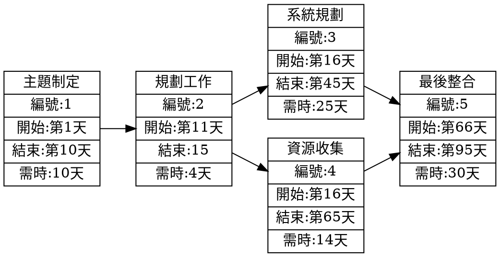
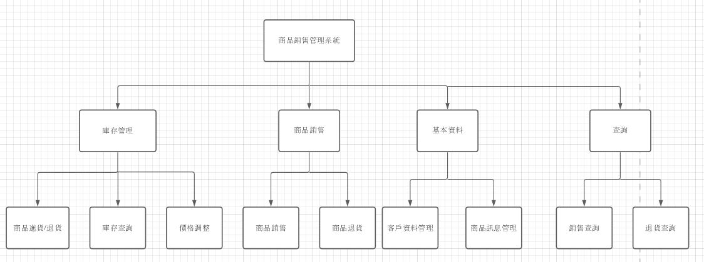
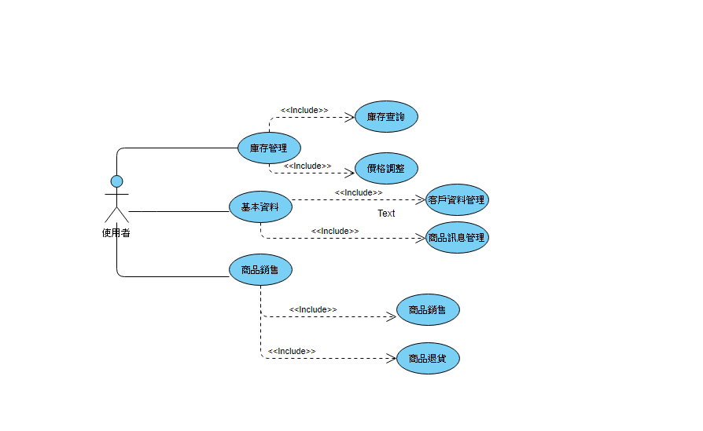
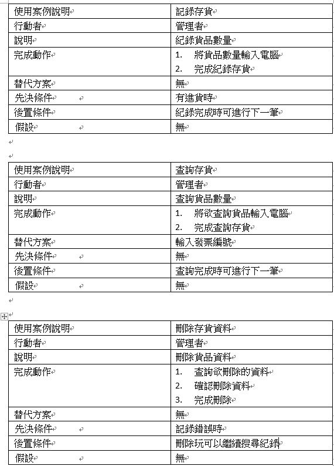
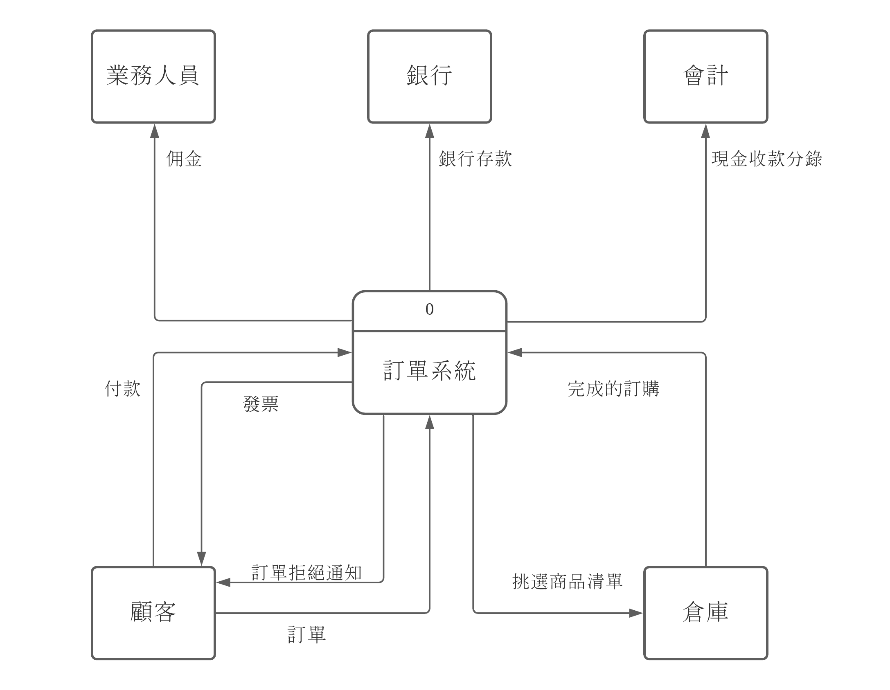
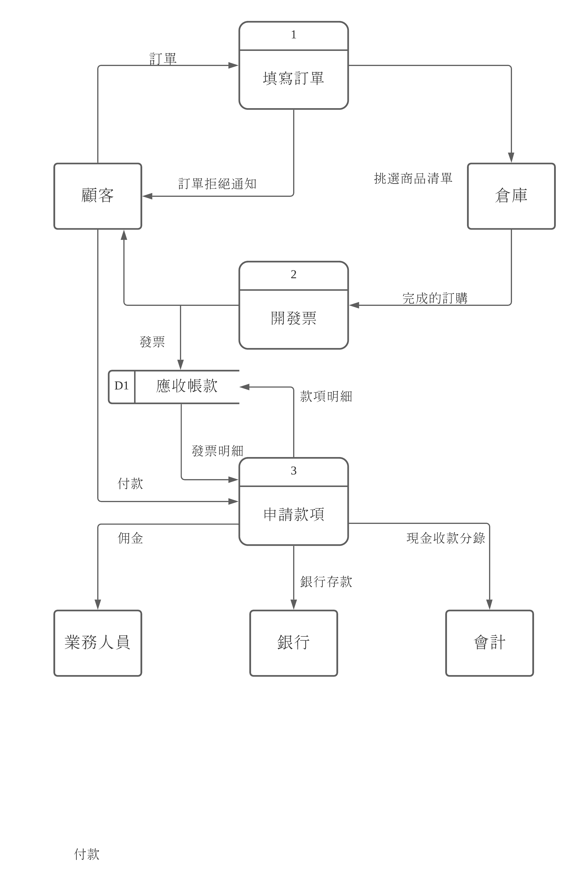
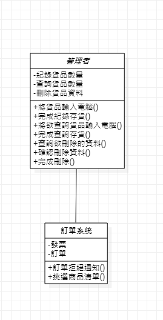
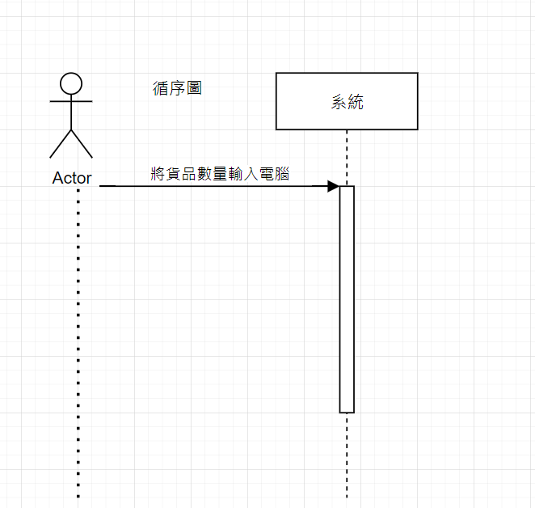

# 主題:線上銷售管理系統


## 內容 :線上銷售管理系統


## 班級:資管三甲

## 組長:C107118107郭弘逸

### 小組成員：C107118107郭弘逸 C107118118邱宏嘉 C107135126劉彥圻
```
工作分配:  郭弘逸:主題討論、製作、
              邱宏嘉:主題討論、報告
              劉彥圻:主題討論、製作、報告
```
 ***


 
 
#### 甘特圖 :


```
gantt
    title 線上銷售管理系統
    dateFormat  YYYY-MM-DD
    section 日程
    主題討論           :a1, 2020-10-13, 14d
     甘特圖            :after a2, 2020-10-27,5d
     規劃架構       :afte  a2,2020-10-27,5d
     資料蒐集          :a2 ,2020-10-31,39d
     內容撰寫          :a3 ,2020-11-15,31d
     內容檢查          :a4,2020-12-10,19d
     報告              :a5,2020-12-29,7d   

```
 


#### PERT圖 :



 *** 
 功能性需求 : 
 * 庫存查詢
 * 客戶購買資料
 * 購買作業
 
 非功能信需求 :
 * 反應時間:1秒內
 * 使用度:高
 * 可靠度:極高

#### 功能分解圖 FDD :


需求分析
* 使用此系統可以幫助使用者進行庫存管理
* 幫助使用者查詢銷售情況
* 幫助使用者管理客戶資料

#### 使用案例圖 :


#### 使用案例說明 :


#### 系統環境圖 DFD :


#### DFD 0程序 :


#### UML :


#### 循序圖 :

