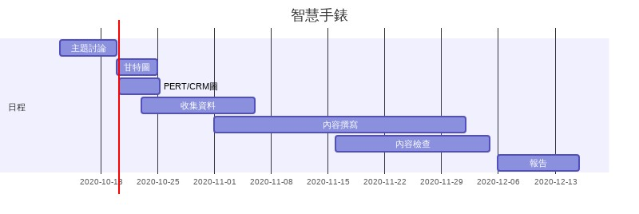
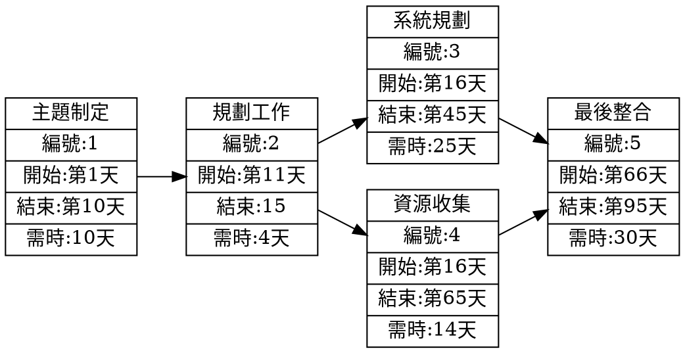
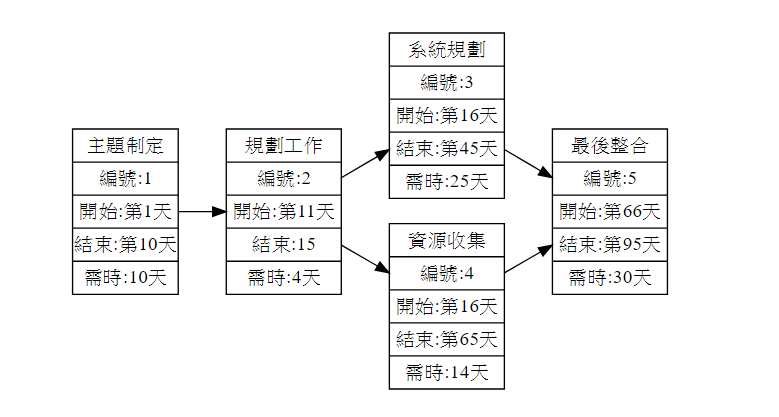

# 2020_OO

## 班級:資管三甲

### 小組成員：C107118107郭弘逸 C107118118邱宏嘉 C107135126劉彥圻

#### 主題:智慧手錶應用


##### 內容:


 
 
 
#### 甘特圖編碼:
```
gantt
    title 智慧手錶
    dateFormat  YYYY-MM-DD
    section 日程
    主題討論           :a1, 2020-10-13, 7d
     甘特圖            :after a2, 2020-10-20,5d
     PERT/CRM圖       :afte 2020-10-20,5d
     收集資料          :a2 ,2020-10-23,14d
     內容撰寫          :a3 ,2020-11-01,31d
     內容檢查          :a4,2020-11-16,19d
     報告              :a5,2020-12-06,10d       
     

```
 





#### PERT圖編碼:





